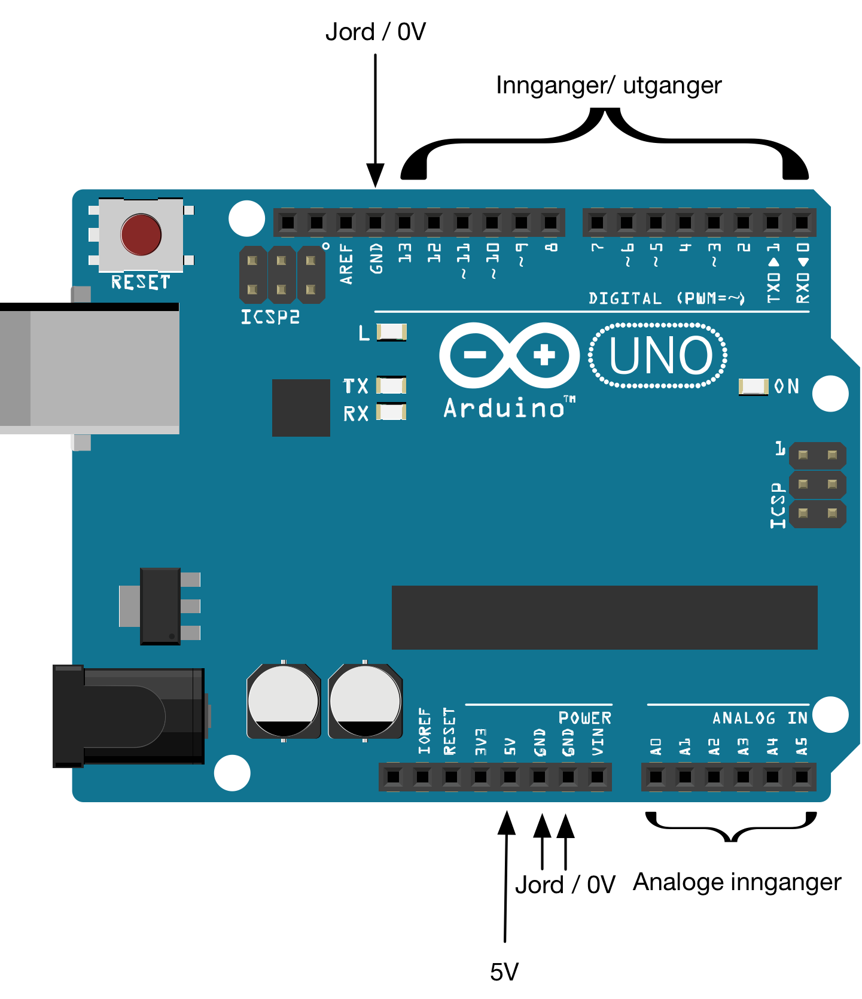

## Kom i gang

Arduino er en åpen (open source software og hardware) plattform bestående av en enkel mikroprosessor og programvare som ble utviklet i Italia i 2003 av Interaction Design Institute Ivrea. Enheten er oppkalt av en lokal bar i nærheten av skolen. Plattformen er svært populær for amatører for å få innføring i mikroprosessorer og i skole og annen opplæring. Den er også veldig populær til prototyping.

Etter lanseringen har det etterhvert kommet mange forskjellige nye modeller og kopier, men ofte benyttes klassikeren, Arduino Uno, eller enheter som er lik på denne.

Arduino kobles vanligvis til PC eller Mac med USB. Selve enheten er på størrelse med et bankkort med innganger og utganger som sørger for kommunikasjon med eksterne enheter som brytere, vriknotter, lamper og små høyttalere. Arduino programmeres som oftest med forenklet versjon av C++. Arduino kan integreres med veldig mange forskjellige språk og verktøy.

Det er et stort fagmiljø rundt Arduino og det finnes veldig mange tips og oppskrifter på nettet. Veldig mange standard sensorer, brytere, skjermer, og utbyggingskort fungerer godt med Arduino. Dette betyr at det er stort utvalg av enheter som kan kobles til Arduino.

### Installasjon av Arduino IDE

Last ned programvaren her:

* [http://www.arduino.cc/en/Main/Software](http://www.arduino.cc/en/Main/Software)

Pakk ut filen på valgfritt sted og dobbeltklikk på den.

#### Mer informasjon
Mer om installasjon og instrukser for flere operativsystemer finner du her (se avsnitt "Install the Arduino Desktop IDE"):

* [http://arduino.cc/en/Guide/HomePage](http://arduino.cc/en/Guide/HomePage)

### Bli kjent med Arduinoen

Arduino har en rekke innganger:

* **USB** - for tilkopling til PC/ Mac/ Linux
* **Jord / GND** - for å skape felles jordingspunkt for dine kretser
* **5V** - for å gi spenning til dine kretser
* **Innganger/ utganger**: - for å avgi eller avlese digitale signaler. 
  * **Analoge innganger** - kan måle spenning fra 0 til 5 volt
  * **Digital innganger** - kan måle enten 0  eller 5 volt (høy/ lav)
  * **Digital utganger** - kan avgi enten 0  eller 5 volt (høy/ lav)

Merk at de digitale inngangene og utgangene deler samme fysiske inngang/ utgang.

#### Mer informasjon

 * [LKK:Blinkende lysdiode](https://oppgaver.kidsakoder.no/arduino/blinkende_lysdiode/blinkende_lysdiode)
 * [circuit.io: An Introduction to arduino uno pinout](https://www.circuito.io/blog/arduino-uno-pinout/)

