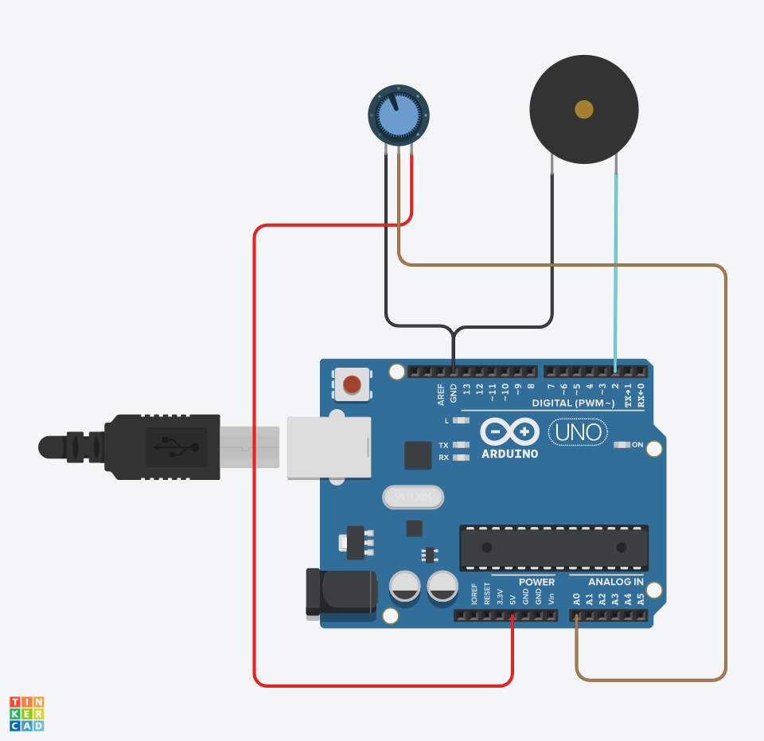
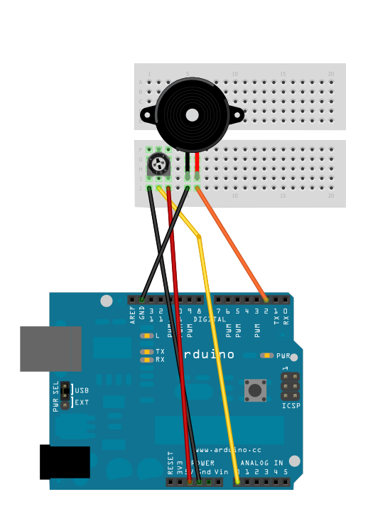

## Lag ulyder med potmeter og høyttaler

### Funksjonalitet

Når bruker vrir på et potmeter, endre tonen som avgis i en høyttaler

* når potmeteret vris mot klokken, blir tonen mørkere
* når potmeteret vris med klokken, blir tonen lysere

### Du trenger

| Type          | Antall           | Kommentar  |  Utseeende |
| ------------- | :------------- | :-----| :----: |
| Piezo element	| 1 | Dette er høyttaleren	 | 
| Potmeter	| 1 | Dette er den du vrir på for å bestemme tonehøyden | 	 


### Simulering i TinkerCAD



Se også:
* [Krets i TinkerCAD](https://www.tinkercad.com/things/cTZKhnwJqq2-knowitarduino-intropotmeteroghoyttaler/editel)

### Konstruksjon




### Program

```
void setup() {
  pinMode(2,OUTPUT);
}

void loop() {
    // lag en tone med samme frekvens som motstanden i potmeteret
    tone(2, analogRead(0) );
}
``` 

### Oppgave

Koble til en knapp. Når knappen trykkes, lages en lyd av bombe som eksploderer
 
#### Mer informasjon
Dokumentasjon på Tone API:
* [http://www.arduino.cc/en/Reference/Tone](http://www.arduino.cc/en/Reference/Tone)


Problemer? Se [fasit](./fasit.md)


