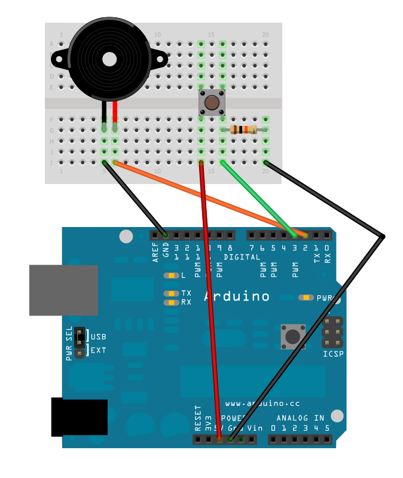
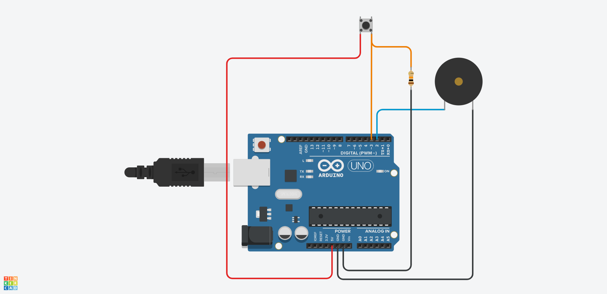

### Fasit: Lag ulyder med potmeter

#### Konstruksjon



#### Simulering i TinkerCAD



Se også:
* [Krets i TinkerCAD](https://www.tinkercad.com/things/d0f6X5CvnYa-knowitarduino-intropotmeteroghoyttaler-fasit/editel)

#### Program

```
int piezo = 2;
int btn = 3;

void setup() {
  pinMode(piezo, OUTPUT);
  pinMode(btn, INPUT);
}

void loop() {

  if ( digitalRead(btn) ) {
    for ( int i = 4000 ; i > 200 ; i = i-2 ) {
      tone(piezo, i);
      delay(1);
    }
    for ( int i = 1000 ; i > 0 ; i-- ) {
      tone(piezo, random(2000));
      delay(1);
    }

  }
  noTone(piezo);

} 
```
