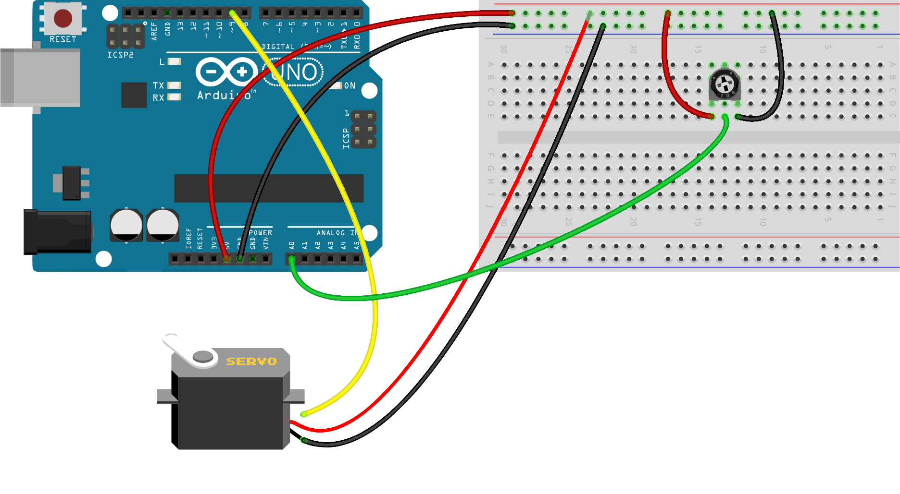

### Fasit: Styr LED fra Lampe

#### Konstruksjon



#### Program

```
#include <Servo.h>

int pot = 0;
Servo myservo;
int angle = 0;

void setup() {
  myservo.attach(9);
  pinMode(pot,INPUT);
}

void loop() {
    angle = analogRead(pot)*(180/1023.0);
    myservo.write(angle);
}
```
