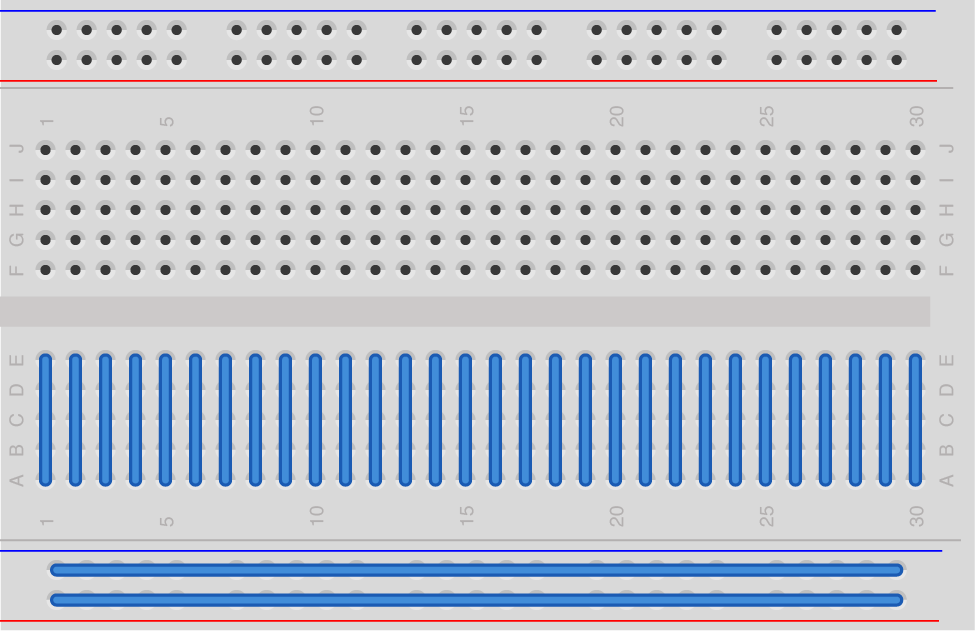
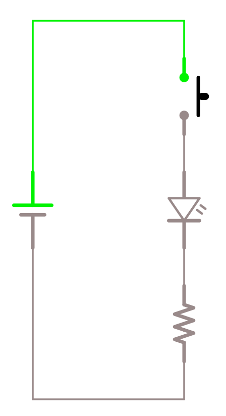

## Om bruk av breadboard

I kurset kommer vi til å bruke et breadboard til lage elektriske kretser. Breadboard lar oss enkelt koble komponenter midlertidig til og fra for rask prototyping.

Breadboard ser slik ut:

Det har en rekke "hull" der kan man sette inn komponenter som inngår i kretsen. Mange av disse hullene er koblet sammen elektrisk.

På denne figuren har vi tegnet inn de elektriske koblingene på den nederste delen av kortet:

Som vist på figuren, er hullene i de horisontale rekke på toppen og bunn koblet sammen i horisontal retning, og de vertikale rekkene i de to midterste områdene koblet sammen vertikalt.

Som et eksempel, tenk deg en krets der en lampe (LED) er koblet til en motstand og deretter til en bryter:

Denne kretsen kan lages på et breadboard slik:

Slik ser kretsen ut i virkeligheten:

