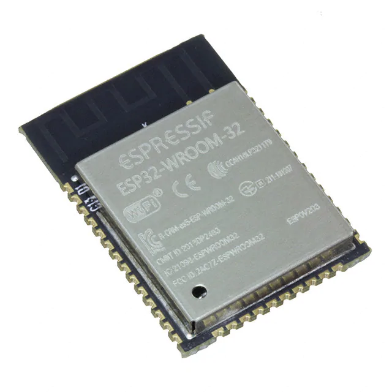
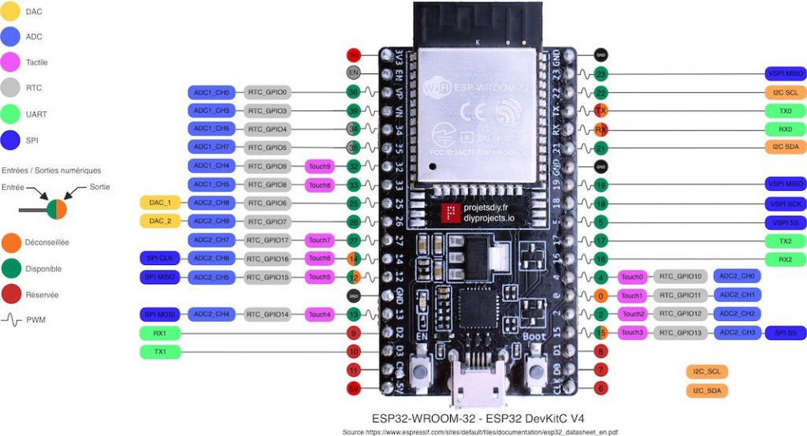

# Om ESP32

ESP32 er en serie billige, mikrobrikkere med integrert Wi-Fi og Bluetooth.  De bruker lite strøm og tar liten plass.

ESP32 er designet av Espressif Systems, et Shanghai-basert kinesisk selskap, og er produsert av TSMC ved bruk av deres 40 nm-prosess. Den er en etterfølger til ESP8266 mikrokontrolleren.

ESP32 og ESP8266 er veldig populære til prototyping på grunn av deres lave pris, enkelhet i bruk, dokumentasjon og tilgjengelighet til informasjon på nettet.

En ESP32 er ca. på størrelsen med en negl og inneholder det meste man trenger for å lage en IoT- enhet:



Slike chipper kalles ofte System on a Chip (SoC) fordi de inneholder alle de viktigste komponentene til en datamaskin, slik som:
 - prosessor
 - minne
 - støtteprosessorer (dvale, kryptering m.m.)
 - trådløse kommunikasjonsgrensesnitt (WiFi og Bluetooth)
 - trådbaserte kommunikasjonsgrensesnitt (SPI, RS232, I2C)

For å gjøre det enklere å bruke chippen for prototyping settes den ofte på såkalte development boards:


## Funksjoner
* CPU: Xtensa dual-core (eller single-core) 32-bit LX6 microprocessor, på 160 eller 240 MHz.
* Ultra low power (ULP) co-processor
* Minne: 320 KiB RAM, 448 KiB ROM og mulighet for å bruke ekstra minne.
* Wi-Fi: 802.11 b/g/n
* Bluetooth: v4.2 BR/EDR og BLE (deler radio med Wi-Fi)
* Integrerte enheter, bl.a
    * 34 × programmerbare GPIOs (innganger og utganger)
    * 12-bit ADC på opptil 18 kanaler (analoge innganger)
    * 2 × 8-bit DACs (analoge utganger)
    * 10 × touch sensorer (kapasitive sensorer)
    * 4 × SPI (serieporter for tilkobling av eksterne enheter)
    * 2 × I²S interfaces (grensesnitt for digital lyd)
    * 2 × I²C interfaces (serieporter for tilkobling av eksterne enheter)
    * 3 × UART (enheter for seriell kommunikasjon)
    * SD/SDIO/CE-ATA/MMC/eMMC host controller (for tilkobling av minnenheter)
    * Ethernet MAC interface
    * CAN bus 2.0
    * PWM for styring av motorer og LEDs
* Integrerte sikkerhetmekaniser, bl.a. 
    * IEEE 802.11 standard inkludert WPA, WPA2, WPA3 og WAPI
    * Sikker boot
    * Kryptering av flash
    * Hardwareaksellerert kryptering: AES, SHA-2, RSA, m.m.
* Støtte for lavt strømforbruk

## Pins

ESP32 har mange innganger og utganger. Enkelte av disse har mange moduser, mens enkelte har begrensninger. Noen av pinnene er veldig spesifikke brukes til
å gi strøm til andre enheter eller for å 
boote enheten.

Pins som kan har mange bruksområder kalles som oftes General Purpose Input Output (GPIO). Disse har har mange bruksområder. Hva de skal brukes til
settes av programvaren i chippen.

Eksempel på bruksområder for GPIOer:
- lese av verdier fra analoge sensorer (f.eks temperatursensor)
- kommunisere med digitale sensorer (f.eks GPS)
- kommunisere med andre mikrokontrollere
- touch-sensorer (merker om de blir berørt)
- digitale utganger (f.eks skru av eller på en LED/ lampe)
- digitale utganger med PWM (f.eks dimme en LED/ lampe)

Dette er to enkle eksempler som viser oppsett av to pins, en som inngang (pin 32) og en som utgang (pin 34):

```
pinMode(32, INPUT);
pinMode(34, OUTPUT);
```

Følgende diagram viser såkalt pinout av ESP32 (hva de ulike pins kan brukes til):




Kilde: [diyprojects.io](https://diyprojects.io/)
