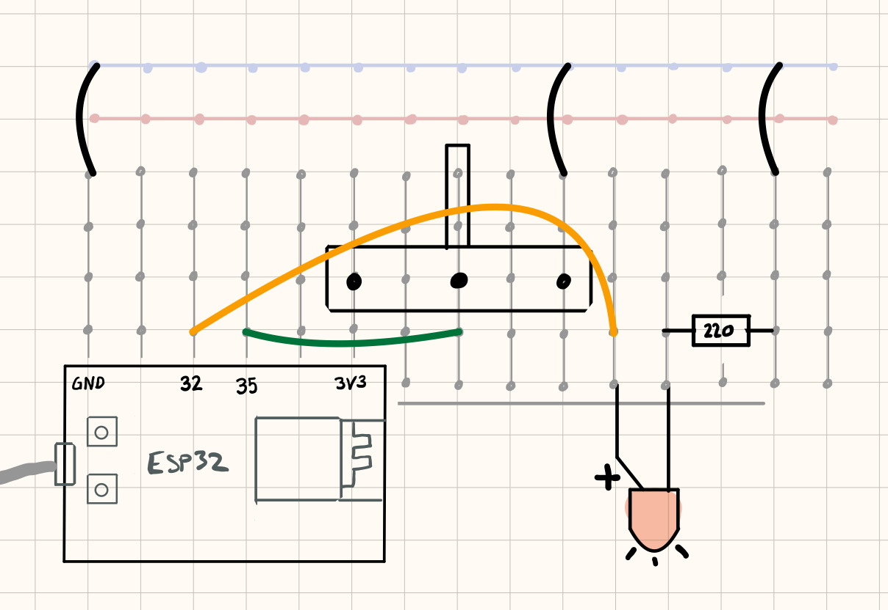
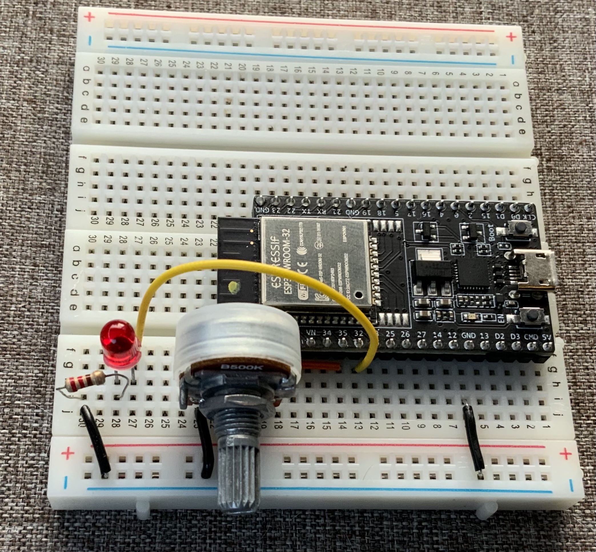

### Oppgave
I denne oppgaven skal du kontrollere lysintensiteten på en LED.

Vi styrer intensiteten til lampen ved ved å å slå den fort av og på i høyt temp.  Dette kalles PWM eller pulse width modulation. 

Se også: [Wikipedia:Pulse-width modulation](https://en.wikipedia.org/wiki/Pulse-width_modulation)

ESP32 har såkalte PWM- kanaler tilgjengelig som gir lavnivåfunksjonalitet for dette. Sammenliknet med en del andre mikrokontrollere er ESP32 litt mer tungvindt å programmere, men tilgjengelig en del mer fleksibel på PWM.

### Du trenger

| Type          | Antall           | Kommentar  |  Utseeende |
| ------------- | :------------- |:-----| :----: |
| Potmeter	| 1 | | 
| Breadboard (prototypebrett)	| 1 | | 
| ESP32 | 1 | | 
| LED           | 1    | Lampe. Farge og størrelse kan variere | 
| Motstand 330 Ohm eller 200 ohm | 1 | Denne beskytter LED mot for høy strøm | 

### Konstruksjon

Konsrtruksjonen bygger videre på [Les potmeter](../LesPotmeter/README.md).





### Kode

Programmet gjør følgende

1. Leser potmeterets verdi (du får det som en int mellom 0 og 1023.
2. LEDen dimmes tilsvarende verdien på potmeteret.


```
#include "Arduino.h"
int potPin = 35;
int ledPin = 32;

// instillinger for PWM
const int freq = 5000;
const int ledChannel = 0;
const int resolution = 8;

void setup() {
    Serial.begin(115200);

    // konfigurer til å lese verdi (INPUT) fra potmeter
    pinMode(potPin, INPUT);
    pinMode(ledPin, OUTPUT);

    // konfigurer LED PWM
    ledcSetup(ledChannel, freq, resolution);
    // assosier PWM- kanal med led pin
    ledcAttachPin(ledPin, ledChannel);
}

void loop() {
    int potValue = analogRead(potPin);
    ledcWrite(ledChannel, potValue / 16);
}
```
