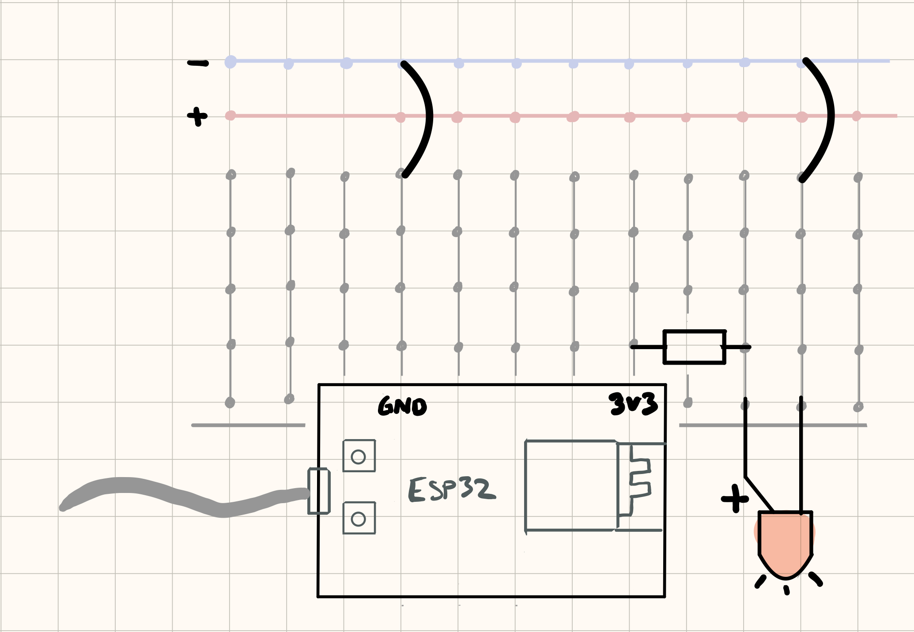
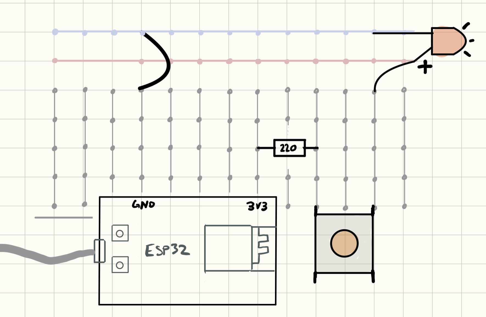

## Enkle analoge kretser uten mikrokontroller

Vi skal lage to enkle kretser som ikke bruker datakraften i mikrokontrolleren, men bruker den kun som strømkilde.

Hensikten er å bli kjent med bruk av breadboard og tolkning av enkle elektroniske kretser.

Hvis du har tidligere erfaring med tolkning av kretser og bruk av breadboard, kan du hoppe over disse oppgavene.

### Lampe som lyser konstant

Vi begynner først med en svært enkel krets:


### Du trenger

| Type          | Antall           |  Utseeende |
| ------------- | :------------- | :----: |
| LED           | 1    |   (farge kan variere)
| Motstand 330 Ohm eller 220 ohm | 1 |   	
| Breadboard (prototypebrett)	| 1 | 
| ESP32 | 1 | 

* ESP32 fungerer som en statisk strømkilde og mer merket ```5V``` i diagrammet
* Strømmen går fra strømkilden gjennom motstanderen og så inn i LED-en (lampen)
* Strømmen går fra LED-en tilbake til negativ side på strømforsyningen

Funksjonen til motstanden er å begrense hvor mye strøm som går gjennom LED-en slik at LED-en ikke går i stykker.

Koble opp slik:




### Lampe med analog knapp

Denne gangen blir det bare bittelittegranne vanskeligere. Vi legger inn en knapp for å styre lampen:


### Du trenger

| Type          | Antall           |  Utseeende |
| ------------- | :------------- | :----: |
| LED           | 1    |   (farge kan variere)
| Trykkbryter	| 1	   |    
| Motstand 330 Ohm eller 220 ohm | 1 |   	
| Breadboard (prototypebrett)	| 1 | 
| ESP32-CAM | 1 | 


Koble opp slik:




