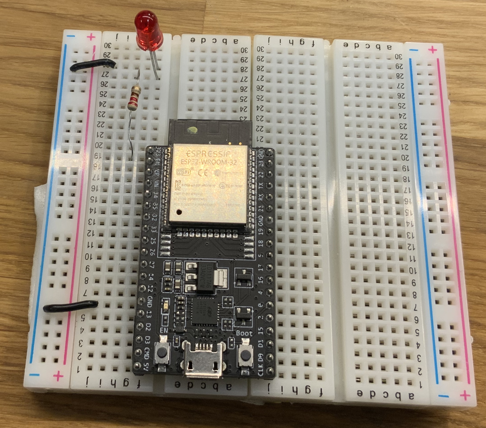
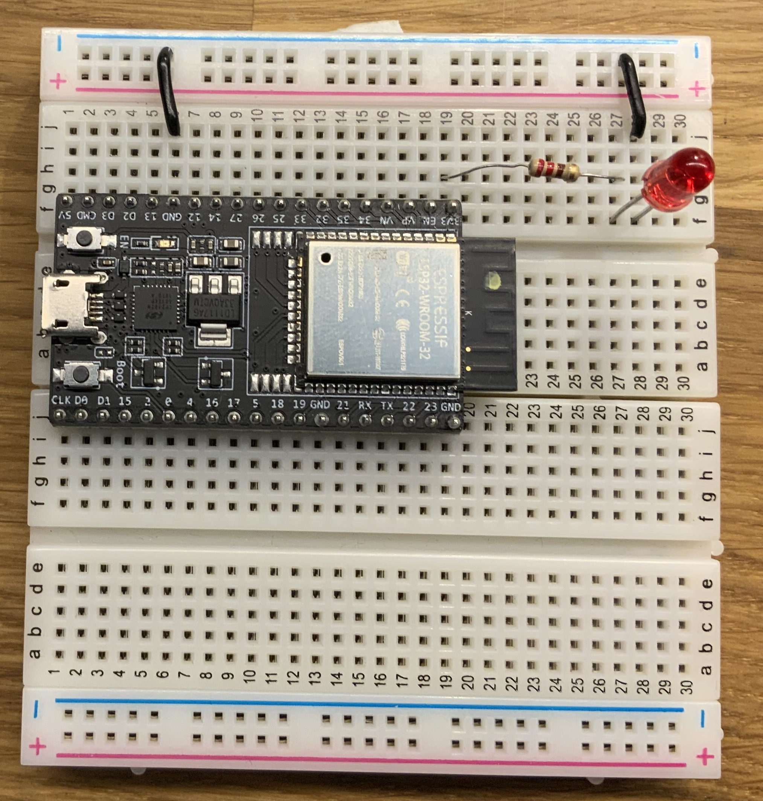
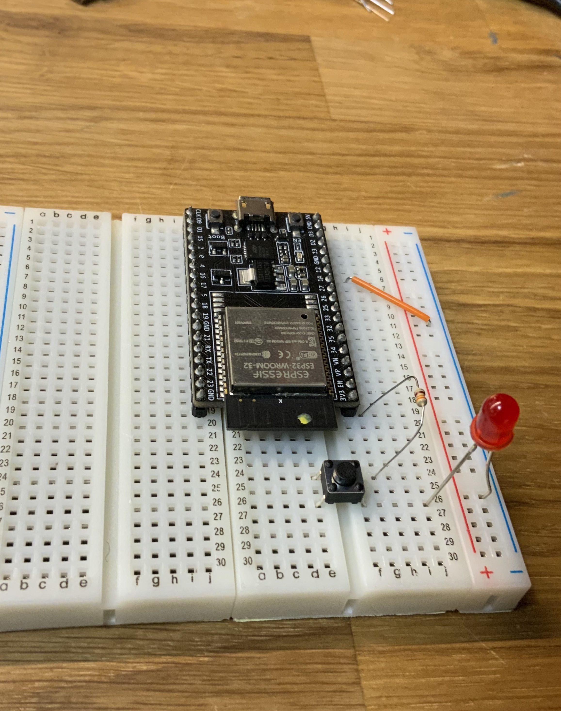
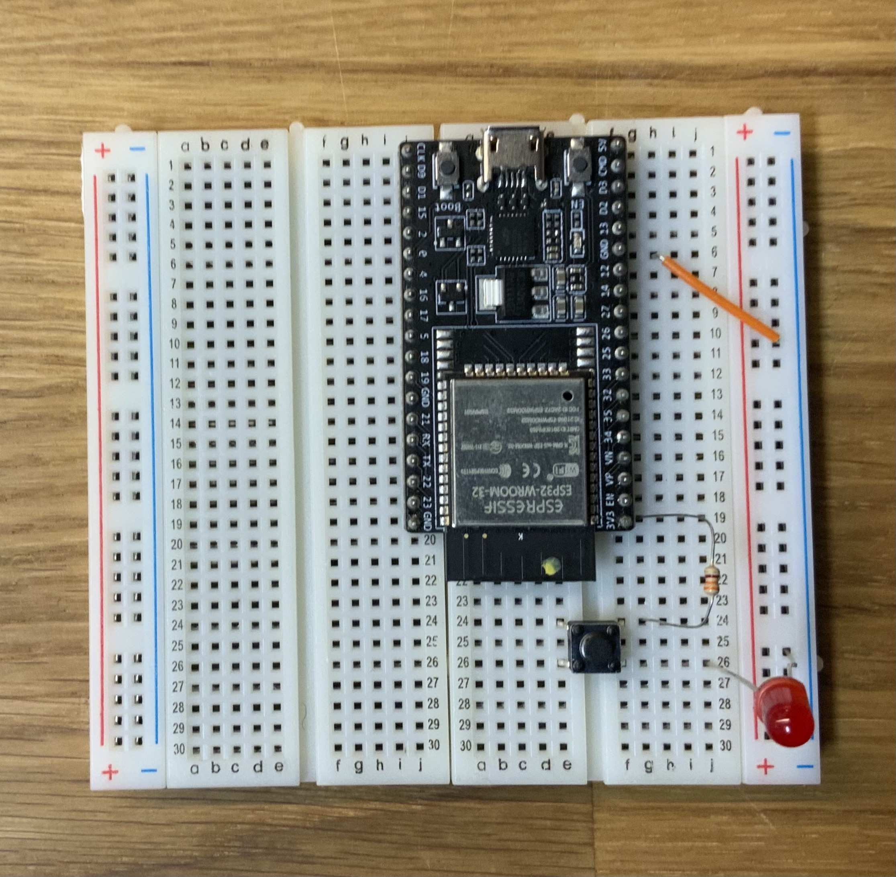

## Enkle analoge kretser uten mikrokontroller

### Lampe som lyser konstant

#### Funksjonalitet

Vi skal lage to enkle kretser som ikke bruker datakraften i mikrokontrolleren, men bruker den som strømkilde.

Hensikten er å bli kjent med bruk av breadboard og kunne tolke enkle elektroniske kretser.

Hvis du har tidligere erfaring med tolkning av kretser og bruk av breadboard, kan du hoppe over disse oppgavene.


Vi begynner først med en svært enkel krets:


#### Du trenger

| Type          | Antall           |  Utseende |
| ------------- | :------------- | :----: |
| LED           | 1    |   (farge kan variere)
| Motstand 330Ω | 1 |   	
| Breadboard (prototypebrett)	| 1 | 
| ESP32 | 1 | 

#### Konstruksjon
Koble opp slik:





#### Forklaring
* ESP32 fungerer som en statisk strømkilde og er merket ```5V``` i diagrammet
* Strømmen går fra strømkilden gjennom motstanden og så inn i LED'en (lampen)
* Strømmen går fra LED'en tilbake til negativ side på strømforsyningen

Funksjonen til motstanden er å begrense hvor mye strøm som går gjennom LED-en slik at LED-en ikke går i stykker.


### Lampe med analog knapp

Denne gangen blir det bare bittelittegranne vanskeligere. Vi legger inn en knapp for å styre lampen:


#### Du trenger

| Type          | Antall           |  Utseende |
| ------------- | :------------- | :----: |
| LED           | 1    |   (farge kan variere)
| Trykkbryter	| 1	   |    
| Motstand 330Ω | 1 |   	
| Breadboard (prototypebrett)	| 1 | 
| ESP32 | 1 | 

#### Konstruksjon

Koble opp slik:





#### Forklaring

* Strømmen går fra strømkilden, gjennom motstanden, inn i bryteren, og - hvis bryter er trykket inn, inn i LED'en (lampen)
* Strømmen går fra LED'en tilbake til negativ side på strømforsyningen
