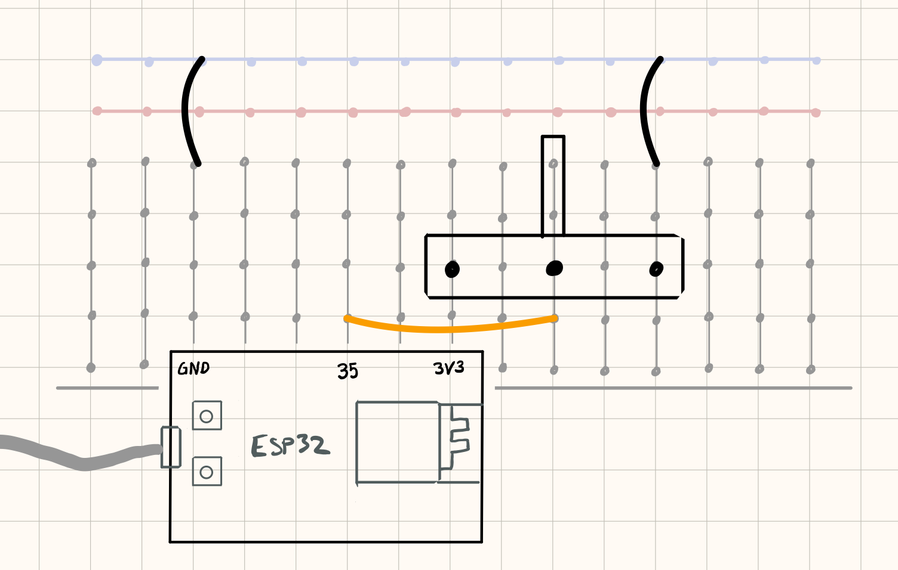
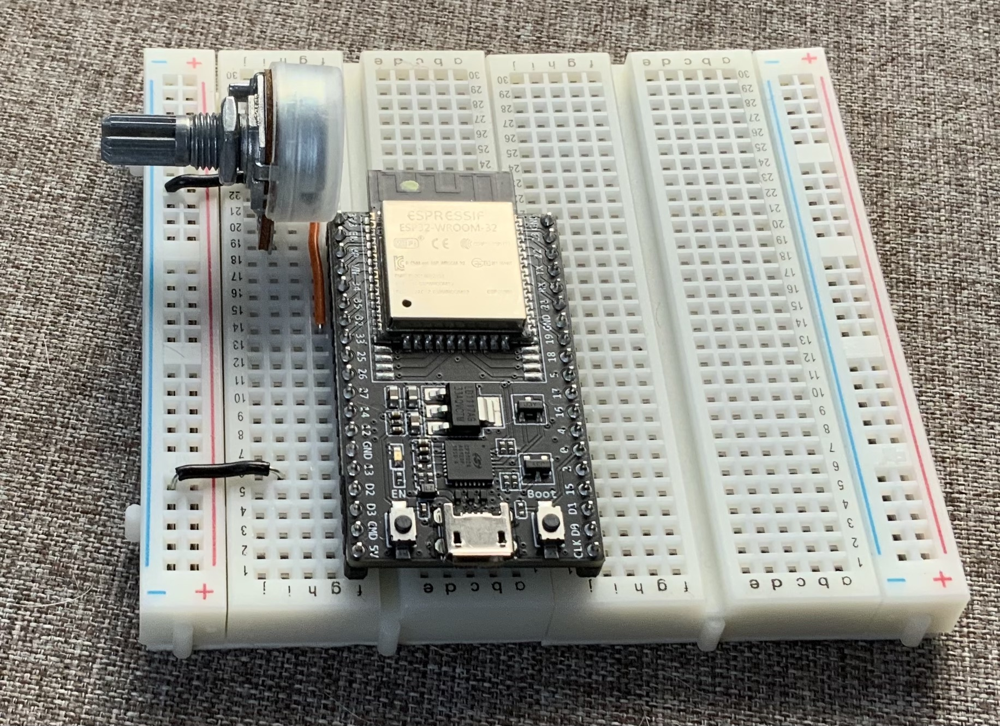
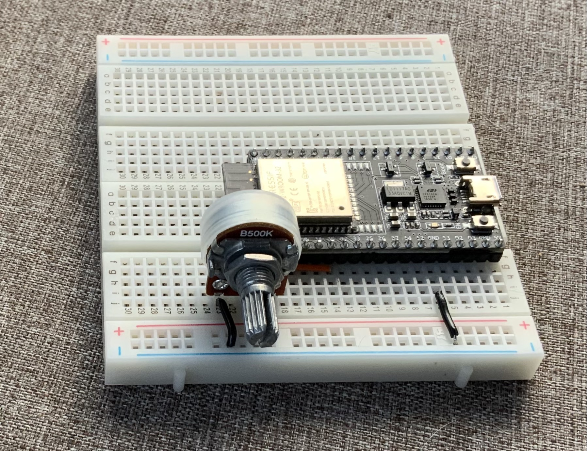

## Les potmeter

Et potmeter (fullt navn: på engelsk: potentiometer, på nynorsk: potensiometer) er en komponent som endrer motstand når du vrir på akselen. Mange kjenner disse igjen fra volumkontroller o.l.

Potmeter er en analog innenhet. Den midterste foten gir en spenning som ligger mellom de to andre avhengig av hvor posisjon på meteret.

For å lese verdier fra analoge innenheter, må vi bruke en ADC (Analog Digital Converter) som er innebygget i ESP32. For å gjøre dette, bruker vi funksjonen ```analogRead```.

### Funksjonalitet

ESP32-en leser av potmeteret og rapporterer verdien tilbake til datamaskinen over serieport.

Potentiometeret har en variabel motstand som endrer seg når du vrir på det.

### Du trenger

| Type          | Antall           | Kommentar  |  Utseende  |
| ------------- | :------------- |:-----| :----: |
| Potmeter	| 1 | | 
| Breadboard (prototypebrett)	| 1 | | 
| ESP32 | 1 | | 


### Konstruksjon





### Program

Legg inn følgende program:

```cpp
#include "Arduino.h"
int potPin = 35;

void setup() {
    Serial.begin(115200);
    // konfigurer til å lese verdi (INPUT) fra potmeter
    pinMode(potPin, INPUT);
}

void loop() {
    Serial.println(analogRead(potPin));
    delay(100);    
}
```

Når programmet er lastet opp og kjører, vrir du på potmeteret og ser at det leses ut ulike verider:


```

1849
1517
999
494
35
0
0
0
0
0
0
102
459
715
831

```


