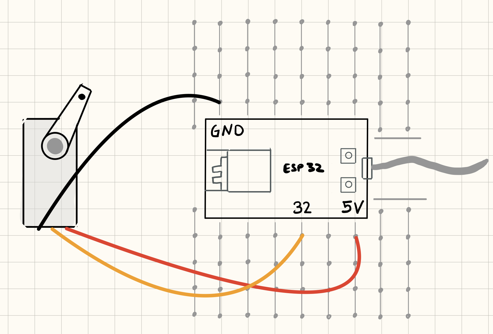

## Servo


### Funksjonalitet

I denne leksjonen skal vi teste ut på koble servomotor til mikrokontrolleren.

### Du trenger

| Type          | Antall           | Kommentar  |  Utseeende |
| ------------- | :------------- |:-----| :----: |
| TM1638 Led & Key | 1 | | 
| Breadboard (prototypebrett)	| 1 | | 
| ESP32 | 1 | | 


### Konstruksjon




### TM1638 Driver

For å kommunisere med TM1638-chippen trenger vi en driver. Driveren legges iss om en ekstern avhengighet: `roboticsbrno/ServoESP32 @ ^1.0.3`

Full `platformio.ini` fil:
```
[env:esp32dev]
platform = espressif32
board = esp32dev
framework = arduino
monitor_speed = 115200
lib_deps =
     roboticsbrno/ServoESP32 @ ^1.0.3
```

### Program

Legg inn følgende program:

```
#include <Arduino.h>
#include <Servo.h>

Servo myservo;

int pos = 0;

void setup() {
    myservo.attach(32); // attaches the servo on pin 9 to the servo object
}

void loop() {
    for (pos = 0; pos <= 180; pos += 1) {
        myservo.write(pos);
        delay(15);
    }
    delay(250);
    myservo.write(0);
    delay(1000);
}

```

Når du kjører koden, styrer mikrkontrolleren servomotoren slik at den går sakte i en retning frem til 180 grader og deretter raskt tilbake til 0 grader.
