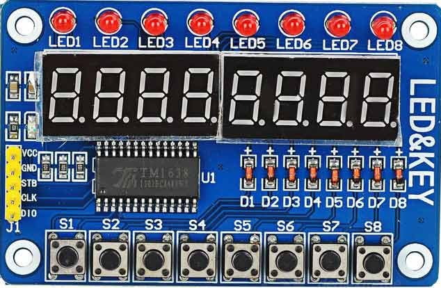
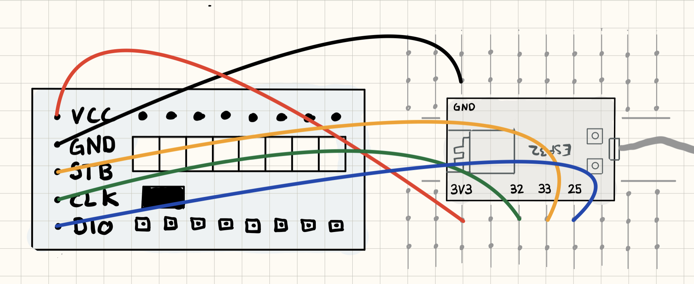

## TM1638

TM1638 er en chip 

TM1638 -chippen er en mikrokontroller dedikert til å drive lysdioder, numerisk display og tastaturskanningsgrensesnitt. Den integrerer et mikrokontroller med digitalt grensesnitt.

Chippen selges ofte i kombinasjon med mange billige moduler som inkluderer bl.a. LEDs, fysiske knapper m.m. Disse kan være veldig nyttige for å lage fysisk brukergrensesnitt siden de tilbyr mye funksjonalitet for en billig penge og et fåtall av innganger og utganger.

### Funksjonalitet

I denne leksjonen skal vi teste ut enkle programmer som utnytter funksjonaliteten i en modul som ofte kalles "LED&Key".

### Du trenger

| Type          | Antall           | Kommentar  |  Utseeende |
| ------------- | :------------- |:-----| :----: |
| TM1638 Led & Key | 1 | | 
| Breadboard (prototypebrett)	| 1 | | 
| ESP32 | 1 | | 


### Konstruksjon



### TM1638 Driver

For å kommunisere med TM1638-chippen trenger vi en driver. Driveren legges iss om en ekstern avhengighet: `TM1638plus`

Full `platformio.ini` fil:
```
[env:esp32dev]
platform = espressif32
board = esp32dev
framework = arduino
monitor_speed = 115200
lib_deps = gavinlyonsrepo/TM1638plus @ ^1.7.0
```

### Program

Legg inn følgende program:

```
#include <TM1638plus.h>

#define STROBE_TM 33
#define CLOCK_TM 32
#define DIO_TM 25
bool high_freq = true; //default false, If using a high freq CPU > ~100 MHZ set to true.

TM1638plus tm(STROBE_TM, CLOCK_TM, DIO_TM, high_freq);

void setup()
{
    tm.displayBegin();
}

void loop()
{
    tm.displayText("HWGuild  ");
    delay(2000);
    tm.displayText("Knowit  ");
    delay(2000);
}

```

Når du kjører koden vises teksten "knowit" og "hwguild" om hverandre på skjermen etter beste evne. 


I tillegg til å skrive tekst på displayet kan du også lese av hvilke knapper so trykkes og tenne rekken med LEDS over displayet som i dette eksempelet:

```
#include <TM1638plus.h>

#define STROBE_TM 33
#define CLOCK_TM 32
#define DIO_TM 25
bool high_freq = true; //default false, If using a high freq CPU > ~100 MHZ set to true.

TM1638plus tm(STROBE_TM, CLOCK_TM, DIO_TM, high_freq);
int counter = 0;

void setup()
{
    Serial.begin(115200);
    tm.displayBegin();
    Serial.println("OK");
    tm.displayText("Knowit");
}

void loop()
{

    uint8_t buttons = tm.readButtons();
    for (uint8_t LEDposition = 0; LEDposition < 8; LEDposition++)
    {
        tm.setLED(LEDposition, buttons & 1);

        if (LEDposition == 7 && buttons & 1)
        {
            tm.displayText("HWGuild  ");
        }

        if (LEDposition == 6 && buttons & 1)
        {
            tm.displayText("knwowit  ");
        }

        if (LEDposition == 1 && buttons & 1)
        {
            tm.displayIntNum(counter++);
        }

        buttons = buttons >> 1;
    }
}

```

