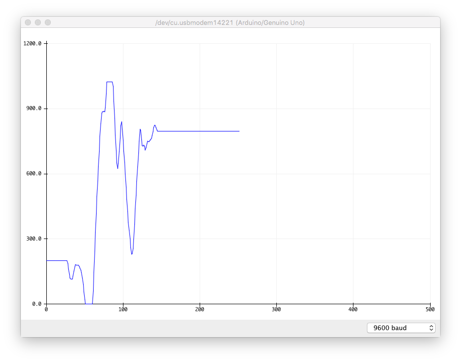

## Les potmeter

Et potmeter (fullt navn: på engelsk: potentiometer, på nynorsk: potensiometer) er en komponent som endrer motstand når du vrir på akselen. Mange kjenner disse igjen fra volumkontroller o.l.

### Funksjonalitet

Arduinoen leser av potmeteret og rapporterer verdien tilbake til datamaskinen over serieport.

Potentiometeret har en variabel motstand som endrer seg når du vrir på det.

### Du trenger

| Type          | Antall           | Kommentar  |  Utseeende |
| ------------- | :------------- |:-----| :----: |
| Potmeter	| 1 | | 


### Konstruksjon


### Program

Legg inn følgende program:

```
void setup() {
  // oppsett av seriell kommunikasjon på 9600 baud
  Serial.begin(9600);
}

void loop() {
    // skriv ut verdien som leses av analog inngang 0
    Serial.println(analogRead(0));
    // vent 500 millisekunder
    delay(500);
}
```

Når programmet er lastet opp og kjører, åpne Serial Monitor, vri på potmeter og les av verdier på inngangen:


Du kan også se verdien i en graf. Lukk Serial Monotor og velg velg menyen Tools -> Serial Plotter. Du skal da se en graf:



### Oppgave
I denne oppgaven skal du kontrollere lysintensiteten på en LED. 

Vi styrer intensiteten til lampen ved ved å å slå den fort av og på i høyt temp.  Dette kalles PWM eller pulse width modulation. 

Det man gjør er at man justerer forholdet mellom hvor ofte LEDen er på, og når den er av.

Bruk funksjonen ```analogWrite``` for å styre LED-en ved hjelp av PWM. Verdien 255 er full styrke, og verdien 0 er lavest styrke. Mer info:

* [https://www.arduino.cc/reference/en/language/functions/analog-io/analogwrite/](https://www.arduino.cc/reference/en/language/functions/analog-io/analogwrite/)

Det du skal gjøre i denne oppgaven er å lage et program som gjør dette:

1. Les potmeterets verdi (du får det som en int mellom 0 og 1023.
2. Dimme LEDen tilsvarende verdien på potmeteret.

Oppkobling:


Problemer? Se [fasit](./fasit.md))
