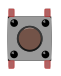

# Utstyr
Du trenger dette ustyret for å gjennomføre alle oppgavene:

| Type          | Antall           |  Utseende |
| ------------- | :------------- | :----: |
| LED           | 1    |  
| Trykkbryter	| 1	   |    
| Motstand 330 Ohm | 1 |   	
| Motstand 10 k Ohm | 1  |  
| Potmeter	| 1 | 
| Breadboard (prototypebrett)	| 1 | 
| ESP32 | 1 | 
| Jumper wires | 5 | 
| 128x64 I2C OLED Display | 1 | 

I tillegg må du ha en datamaskin med Windows, Linux eller Mac. Maskinen må ha USB 2- port eller overgang til USB 2. 

